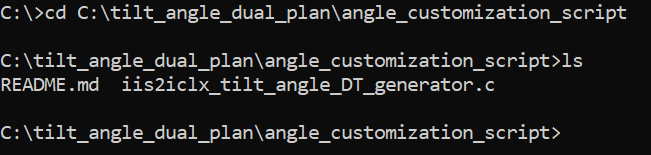
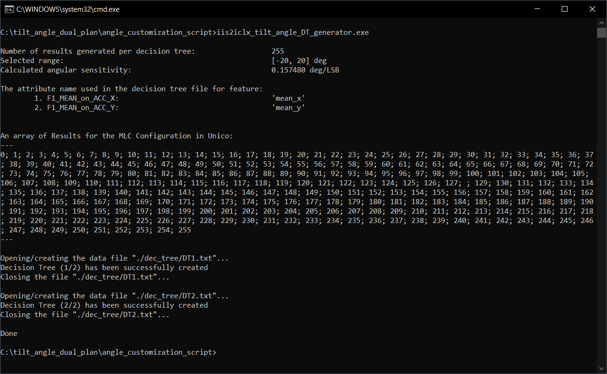

This README file describes how to build and use the **iis2iclx_tilt_angle_DT_generator.c** program to generate two decision trees for tilt sensing, how to create from the decision trees an .ucf configuration file for the **Machine Learning Core (MLC)** of the [**IIS2ICLX**](https://www.st.com/en/mems-and-sensors/iis2iclx.html) and finally how to evaluate the result.

## **Software:**

The main and mandatory SW for this example is the [**Unico-GUI**](https://www.st.com/en/development-tools/unico-gui.html), a graphical user interface (available for Linux, Mac OSX and Windows) that supports the **ProfiMEMSTool** motherboard and allows to build an **MLC** program (even without any board connected = offline mode) or a sensor configuration file.

For further example evaluation it is worth to mention following SW tools:
- [**Unicleo GUI**](https://www.st.com/en/development-tools/unicleo-gui.html), a PC application that supports **STM32 Nucleo boards** coupled with an STM32 Nucleo **MEMS expansion board** for data visualization and demonstration of functionality of ST sensors and algorithms.
- [**AlgoBuilder GUI**](https://www.st.com/content/st_com/en/products/embedded-software/mems-and-sensors-software/inemo-engine-software-libraries/algobuilder.html), a PC application to design a custom processing flow and build the firmware for STM32 Nucleo boards coupled with the MEMS expansions boards, or for form-factor evaluation boards such as the [SensorTile.box](https://www.st.com/en/evaluation-tools/steval-mksbox1v1.html) or the [STWIN](https://www.st.com/en/evaluation-tools/steval-stwinkt1b.html).
- [**X-CUBE-MEMS1**](https://www.st.com/en/embedded-software/x-cube-mems1.html), an expansion software package for **STM32 Nucleo boards** that includes drivers, various sensor sample applications and advanced motion libraries.


## **Hardware:**

This example is meant to be used with the [**IIS2ICLX**](https://www.st.com/en/mems-and-sensors/iis2iclx.html), dual-axis high-accuracy, high-resolution, low-power, digital inclinometer (accelerometer) with embedded Machine Learning Core (MLC). For the purpose of this example, it is also possible to use the [**STEVAL-MKI209V1K**](https://www.st.com/en/evaluation-tools/steval-mki209v1k.html), a dedicated DIL24 adapter board for the IIS2ICLX.

ST provides many ways to evaluate the ST MEMS sensors in general. In this example, it is possible to use e.g. the following boards :
1. [**STEVAL-MKI109V3**](https://www.st.com/en/evaluation-tools/steval-mki109v3.html), or also known as **ProfiMEMSTool** motherboard, that is compatible with all ST MEMS sensors on a DIL24 adapter board. The board is supported by the **Unico-GUI** PC application and is used for sensor performance evaluation.
2. One of our [**STM32 Nucleo boards**](https://www.st.com/en/evaluation-tools/stm32-nucleo-boards.html), for example the [**NUCLEO-F401RE**](https://www.st.com/en/evaluation-tools/nucleo-f401re.html), with a MEMS expansion board, e.g. the [**X-NUCLEO-IKS02A1**](https://www.st.com/en/ecosystems/x-nucleo-iks02a1.html). This set of boards is supported by the **X-CUBE-MEMS1** software package *(only selected Nucleo boards are supported)* and the results can be visualized in the **Unicleo-GUI**.

For further details on the hardware:
- ST resource page on [MEMS sensor](https://www.st.com/mems)
- ST resource page on [Explore Machine Learning Core in MEMS sensors](https://www.st.com/content/st_com/en/campaigns/machine-learning-core.html)
- Application note [AN5536](https://www.st.com/resource/en/application_note/an5536-iis2iclx-machine-learning-core-stmicroelectronics.pdf) on the Machine Learning Core embedded in the [IIS2ICLX](https://www.st.com/en/mems-and-sensors/iis2iclx.html)


# 1. Build the C program
First, it is necessary to install a C compiler. The following lines show the procedure of compilation with the GCC compiler on Windows (using [**Cygwin**](https://www.cygwin.com/)). Cygwin *bin* directory (typically *"C:\cygwin64\bin"*) should be added to the Windows PATH environment variable. Sucessfull GCC installation can be checked by writing `gcc -v` command in the Windows Command prompt (it should display the GCC configuration and its version).

Download the **iis2iclx_tilt_angle_DT_generator.c** file to your PC. The program may be modified according to one's needs in a text editor. However, in many cases or for a basic evaluation, the program is sufficient without any modifications.

Open the Windows Command Prompt (e.g. press Win+R, type cmd and press Enter key) and go to the folder, where the **iis2iclx_tilt_angle_DT_generator.c** is located. For instance, if the file is located in *"C:\tilt_angle_dual_plan\angle_customization_script"*, then you can use the following command:
```
cd C:\tilt_angle_dual_plan\angle_customization_script
```

The correct location can be verified by writing command `dir` or `ls` as visible below:




Write the command to build the **iis2iclx_tilt_angle_DT_generator.c**:
```
gcc iis2iclx_tilt_angle_DT_generator.c -o iis2iclx_tilt_angle_DT_generator
```

The command creates an executable file in current folder (in this case *"iis2iclx_tilt_angle_DT_generator.exe"*).

# 2. Generate decision trees with the built program
After the program is built it is possible to run it simply by using the following command (it will use the default configuration):
```
iis2iclx_tilt_angle_DT_generator.exe
```

This program creates two text files (in *"./dec_tree"* folder), each of which contains a decision tree (one for the x axis and one for y axis of the accelerometer) in the format required by Unico to generate the MLC. Each decision tree contains 255 acceleration threshold levels to be detected, symmetrically spaced around zero in the specified angular range (default is +/- 20 degrees). The acceleration threshold levels correspond to the respective angles of inclination.

*Please note, that typical sensor errors (like zero-g offset, sensitivity error, etc.) are not considered in this example. If more accurate measurement is required, the calibration must be performed and then projected into the calculated threshold levels (modification of the program is then needed).*

The program also displays useful information in the Command Prompt, that is then needed for *.ucf* file generation (it is described in the following section).


It is possible to configure following parameters of the program from the Windows Command Prompt:

- **Angle range** *(default: +/- 20 degrees)*. It must be an integer in range from 2 to 90 [deg]. The final angle range is symmetrical around zero.
- **Output folder name**, where two text files with the decision trees should be stored *(default: "dec_tree")*. It must start with an alphabet character and must not contain following special characters: `<,>:\"/\\|?*@\'^.`.


The program supports the following options:

`-a`	Set the Angle range

`-o`	Set the Output folder name

`-h`	Display help message.


**Example usages:**

1. Following command only prints help of the program:
```
iis2iclx_tilt_angle_DT_generator.exe -h
```

2. Following command executes the program with modified parameters:
```
iis2iclx_tilt_angle_DT_generator.exe -a 25 -o my_folder
```
The parameters are configured as follows:

**Angle range** = +/- 25 degrees

**Folder name** = "my_folder"
