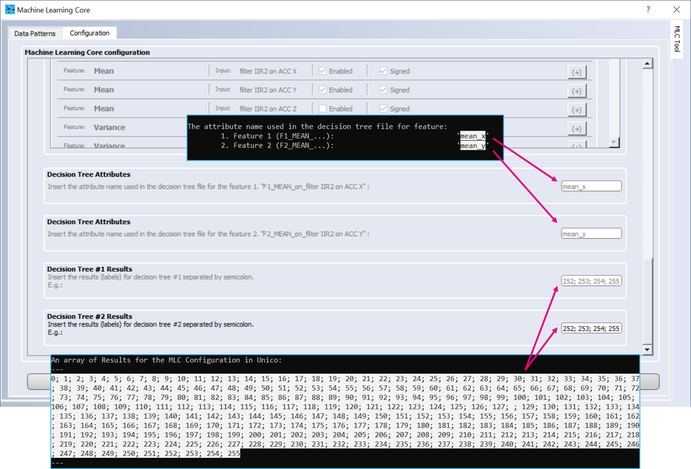

This README file describes how to build and use the **iis2iclx_tilt_angle_DT_generator.c** program to generate two decision trees for tilt sensing, how to create from the decision trees an UCF configuration file for the **Machine Learning Core (MLC)** of the [**IIS2ICLX**](https://www.st.com/en/mems-and-sensors/iis2iclx.html) and finally how to evaluate the result.

## **Software:**

The main and mandatory SW for this tutorial is the [**Unico-GUI**](https://www.st.com/en/development-tools/unico-gui.html), a graphical user interface (available for Linux, MacOS and Windows) that supports the **ProfiMEMSTool** motherboard and allows to build an **MLC** program (even without any board connected = offline mode) or to generate a sensor configuration file (**UCF** file).

For the tutorial it is also necessary to install a C compiler. This tutorial describes the procedure of compilation with the GCC compiler on Windows (using [**Cygwin**](https://www.cygwin.com/)). Please note, that Cygwin *bin* directory (typically *"C:\cygwin64\bin"*) should be added to the Windows PATH environment variable. Sucessfull GCC installation can be checked by writing `gcc -v` command in the Windows Command prompt (it should display the GCC configuration and its version).

To further evaluate the output of this tutorial, it is worth mentioning the following software tools::
- [**Unicleo-GUI**](https://www.st.com/en/development-tools/unicleo-gui.html), a PC application that supports **STM32 Nucleo boards** coupled with an STM32 Nucleo **MEMS expansion board** for data visualization and demonstration of functionality of ST sensors and algorithms.
- [**AlgoBuilder**](https://www.st.com/content/st_com/en/products/embedded-software/mems-and-sensors-software/inemo-engine-software-libraries/algobuilder.html), a PC application to design a custom processing flow and build the firmware for STM32 Nucleo boards coupled with the MEMS expansions boards, or for form-factor evaluation boards such as the [SensorTile.box](https://www.st.com/en/evaluation-tools/steval-mksbox1v1.html) or the [STWIN](https://www.st.com/en/evaluation-tools/steval-stwinkt1b.html).
- [**X-CUBE-MEMS1**](https://www.st.com/en/embedded-software/x-cube-mems1.html), an expansion software package for **STM32 Nucleo boards** that includes drivers, various sensor sample applications and advanced motion libraries.
- [**STM32CubeMX**](https://www.st.com/en/development-tools/stm32cubemx.html), a graphical tool (available for Linux, MacOS and Windows) that allows a very easy configuration of STM32 microcontrollers and microprocessors, as well as the generation of the corresponding initialization C code through a step-by-step process.


## **Hardware:**

The [**IIS2ICLX**](https://www.st.com/en/mems-and-sensors/iis2iclx.html), the dual-axis high-accuracy digital inclinometer with embedded Machine Learning Core (MLC) will be used in this tutorial. In particular, the [**STEVAL-MKI209V1K**](https://www.st.com/en/evaluation-tools/steval-mki209v1k.html), a dedicated DIL24 adapter board for the IIS2ICLX is considered. Anyway, the same procedure shown in this tutorial also applies to other ST sensors with MLC support.

ST provides many evaluation boards for the ST MEMS sensors. In this case, the following boards are selected:
1. [**STEVAL-MKI109V3**](https://www.st.com/en/evaluation-tools/steval-mki109v3.html), or also known as **ProfiMEMSTool** motherboard, that is compatible with all ST MEMS sensors on a DIL24 adapter board. The board is supported by the **Unico-GUI** PC application and is used for sensor performance evaluation.
2. One of our [**STM32 Nucleo boards**](https://www.st.com/en/evaluation-tools/stm32-nucleo-boards.html), for example the [**NUCLEO-F401RE**](https://www.st.com/en/evaluation-tools/nucleo-f401re.html), with a MEMS expansion board, e.g. the [**X-NUCLEO-IKS02A1**](https://www.st.com/en/ecosystems/x-nucleo-iks02a1.html). This set of boards is supported by the **X-CUBE-MEMS1** software package *(only selected Nucleo boards are supported)* and the results can be visualized in the **Unicleo-GUI**.

For further details on the hardware:
- ST resource page on [MEMS sensor](https://www.st.com/mems)
- ST resource page on [Explore Machine Learning Core in MEMS sensors](https://www.st.com/content/st_com/en/campaigns/machine-learning-core.html)
- Application note [AN5536](https://www.st.com/resource/en/application_note/an5536-iis2iclx-machine-learning-core-stmicroelectronics.pdf) on the Machine Learning Core embedded in the [IIS2ICLX](https://www.st.com/en/mems-and-sensors/iis2iclx.html)


# 1. Build the C program


Download the **iis2iclx_tilt_angle_DT_generator.c** file to your PC. The program may be modified according to one's needs in a text editor. However, in many cases or for a basic evaluation, the program is sufficient without any modifications.

Open the Windows Command Prompt (e.g. press Win+R, type cmd and press Enter key) and go to the folder, where the **iis2iclx_tilt_angle_DT_generator.c** is located. For instance, if the file is located in *"C:\tilt_angle_dual_plan\angle_customization_script"*, then you can use the following command:
```
cd C:\tilt_angle_dual_plan\angle_customization_script
```

The correct location can be verified by writing command `dir` or `ls` as visible below:


Write the command to build the **iis2iclx_tilt_angle_DT_generator.c**:
```
gcc iis2iclx_tilt_angle_DT_generator.c -o iis2iclx_tilt_angle_DT_generator
```

The command creates an executable file in current folder (in this case *"iis2iclx_tilt_angle_DT_generator.exe"*).

# 2. Generate decision trees with the built program
After the program is built it is possible to run it simply by using the following command (it will use the default configuration):
```
iis2iclx_tilt_angle_DT_generator.exe
```

This program creates two text files (in *"./dec_tree"* folder), each of which contains a decision tree (one for the x axis and one for y axis of the accelerometer) in the format required by Unico to generate the MLC. Each decision tree contains 255 acceleration threshold levels to be detected, symmetrically spaced around zero in the specified angular range (default is +/- 20 degrees). The acceleration threshold levels correspond to the respective angles of inclination.

*Please note, that typical sensor errors (like zero-g offset, sensitivity error, etc.) are not considered in this tutorial. If more accurate measurement is required, the calibration must be performed and then projected into the calculated threshold levels (modification of the program is then needed).*

The program also displays useful information in the Command Prompt, that is then needed for the *UCF* file generation (it is described in the following section).


It is possible to configure following parameters of the program from the Windows Command Prompt:

- **Angle range** *(default: +/- 20 degrees)*. It must be an integer in range from 2 to 90 [deg]. The final angle range is symmetrical around zero.
- **Output folder name**, where two text files with the decision trees should be stored *(default: "dec_tree")*. The folder will be created in the same folder where the program is run and its name can't contain any of the following characters: `\/:*?\"<>|`.


The program supports the following options:

`-a`	Set the Angle range

`-o`	Set the Output folder name

`-h`	Display help message.


**Example usages:**

1. Following command only prints help of the program:
```
iis2iclx_tilt_angle_DT_generator.exe -h
```

2. Following command executes the program with modified parameters:
```
iis2iclx_tilt_angle_DT_generator.exe -a 25 -o my_folder
```
The parameters are configured as follows:

**Angle range** = +/- 25 degrees

**Folder name** = "my_folder"


# 3. Generate the Unico Configuration File (UCF file)

Once the decision tree files are generated by the *iis2iclx_tilt_angle_DT_generator.exe* program, keep the Command prompt with the usefull program output information open.

Run the **Unico-GUI** and select the *"STEVAL-MKI209V1K (IIS2ICLX)"* item from the list of Device Names. The *"Communication with the motherboard [Enabled]"* option may be unchecked to enable the offline mode (no HW is then needed). Then click to Select Device button/ or double click the *"STEVAL-MKI209V1K (IIS2ICLX)"*.


Confirm the message about limited functionality (only if the offline mode was selected) and open the MLC window:


Go directly to the Configuration tab:


Select the **IIS2ICLX** and choose the required parameters of the **MLC** and sensor. The chosen configuration of the sensor and MLC Output Data Rate (**ODR**) for this tutorial is visible in the picture below:


Set two decision trees from the list and continue configuring the MLC. To suppress high frequency components of the signal, the IIR2 filter was configured as a low-pass filter (f_cut = 5 Hz, ODR = 26 Hz) with the following filter coefficients:


Further examples of filter coefficients can be found in Table 3 in the [AN5536](https://www.st.com/resource/en/application_note/an5536-iis2iclx-machine-learning-core-stmicroelectronics.pdf).

The configuration used for this tutorial is shown in the picture below:


In the next step select only feature **Mean** for inputs **ACC_X** and **ACC_Y** (or only feature **Mean** for inputs **"filter IIR2 on ACC X"** and **"filter IIR2 on ACC Y"**, if a IIR2 filter was used - as in this tutorial). In this tutorial, the Window lenth was set to 1, which means that the filtered acceleration output samples are no further proccessed.


In the next few steps, the output of the *iis2iclx_tilt_angle_DT_generator.exe* program in the Command Prompt will be used. Unico-GUI will ask to "Insert the attribute name used in the decision tree file for the feature 1". Copy/paste the appropriate text from the Command Prompt into the Unico-GUI. The similar should be done for feature 2. In this tutorial, the attribute name for feature 1 is *"mean_x"* and for feature 2 *"mean_y"* (text between the quotation marks). Very similar procedure must be done for the Decision Tree #1/2 Results. The difference is, that one has to copy and paste to the Unico-GUI the whole string between the dashes *"---"* strings. See below the settings of the described steps that were done for this tutorial:



Then browse for the created two text files with the decision tree. The default location is *"./dec_tree"* with respect to the directory, where the program was run. 

The meta-classifier is not necessary for the purpose of this tutorial, so it was left at 0 in both cases (decision tree #1 and decision tree #2).

Finally, select the location and name of the UCF file and it will be automatically generated by the Unico-GUI by clicking on the **Next** button.


**UCF** stands for Unico Configuration File. It is a text file with a sequence of register addresses and corresponding values. It contains the full sensor configuration, including of course the MLC configuration. 

The UCF file can be used as-is by the following software tools provided by ST: Unico GUI, Unicleo GUI, AlgoBuilder GUI.
Moreover, the **UCF files can also be converted into a C source code** and saved as a header *.h* files to be 
conveniently included in C projects. It can be done from main window of the Unico-GUI: click on the *Options tab*, select *Browse* and load the UCF file and then click on *Generate C code*.


As summary, the following configuration was set:

- Device: `IIS2ICLX`
- Machine Learning Core ODR: `26 Hz`
- Inputs: `Accelerometer only`
	- Full scale: `0.5 g`
	- ODR: `26 Hz`
- Number of decision trees: `2`
- Window length: `1`
- Filter configuration: `IIR2 ACC(xyz)`
	- `b1 = 0.194261, b2 = 0.388522, b3 = 0.194261, a2 = -0.426937, a3 = 0.203981` (Low-pass IIR2, f_cut = 5 Hz, ODR = 26 Hz, Gain = 1)
- No other filter used (*End filters configuration*)
- Features:
	- Mean on accelerometer X axis (*"F1_MEAN_on_ACC_X"*) and Mean on accelerometer Y axis (*"F2_MEAN_on_ACC_Y"*)
	- Mean on filtered data of X axis (*"F1_MEAN_on_filter IIR2 on ACC X"*) and Mean on filtered data of X axis (*"F2_MEAN_on_filter IIR2 on ACC Y"*)
- Decision Tree Attributes:
	- Attribute name, feature 1: `mean_x`
	- Attribute name, feature 2: `mean_y`
	- Results for DT1: 
```
0; 1; 2; 3; 4; 5; 6; 7; 8; 9; 10; 11; 12; 13; 14; 15; 16; 17; 18; 19; 20; 21; 22; 23; 24; 25; 26; 27; 28; 29; 30; 31; 32; 33; 34; 35; 36; 37; 38; 39; 40; 41; 42; 43; 44; 45; 46; 47; 48; 49; 50; 51; 52; 53; 54; 55; 56; 57; 58; 59; 60; 61; 62; 63; 64; 65; 66; 67; 68; 69; 70; 71; 72; 73; 74; 75; 76; 77; 78; 79; 80; 81; 82; 83; 84; 85; 86; 87; 88; 89; 90; 91; 92; 93; 94; 95; 96; 97; 98; 99; 100; 101; 102; 103; 104; 105; 106; 107; 108; 109; 110; 111; 112; 113; 114; 115; 116; 117; 118; 119; 120; 121; 122; 123; 124; 125; 126; 127; ; 129; 130; 131; 132; 133; 134; 135; 136; 137; 138; 139; 140; 141; 142; 143; 144; 145; 146; 147; 148; 149; 150; 151; 152; 153; 154; 155; 156; 157; 158; 159; 160; 161; 162; 163; 164; 165; 166; 167; 168; 169; 170; 171; 172; 173; 174; 175; 176; 177; 178; 179; 180; 181; 182; 183; 184; 185; 186; 187; 188; 189; 190; 191; 192; 193; 194; 195; 196; 197; 198; 199; 200; 201; 202; 203; 204; 205; 206; 207; 208; 209; 210; 211; 212; 213; 214; 215; 216; 217; 218; 219; 220; 221; 222; 223; 224; 225; 226; 227; 228; 229; 230; 231; 232; 233; 234; 235; 236; 237; 238; 239; 240; 241; 242; 243; 244; 245; 246; 247; 248; 249; 250; 251; 252; 253; 254; 255
```

	- Results for DT2: 
	
```
0; 1; 2; 3; 4; 5; 6; 7; 8; 9; 10; 11; 12; 13; 14; 15; 16; 17; 18; 19; 20; 21; 22; 23; 24; 25; 26; 27; 28; 29; 30; 31; 32; 33; 34; 35; 36; 37; 38; 39; 40; 41; 42; 43; 44; 45; 46; 47; 48; 49; 50; 51; 52; 53; 54; 55; 56; 57; 58; 59; 60; 61; 62; 63; 64; 65; 66; 67; 68; 69; 70; 71; 72; 73; 74; 75; 76; 77; 78; 79; 80; 81; 82; 83; 84; 85; 86; 87; 88; 89; 90; 91; 92; 93; 94; 95; 96; 97; 98; 99; 100; 101; 102; 103; 104; 105; 106; 107; 108; 109; 110; 111; 112; 113; 114; 115; 116; 117; 118; 119; 120; 121; 122; 123; 124; 125; 126; 127; ; 129; 130; 131; 132; 133; 134; 135; 136; 137; 138; 139; 140; 141; 142; 143; 144; 145; 146; 147; 148; 149; 150; 151; 152; 153; 154; 155; 156; 157; 158; 159; 160; 161; 162; 163; 164; 165; 166; 167; 168; 169; 170; 171; 172; 173; 174; 175; 176; 177; 178; 179; 180; 181; 182; 183; 184; 185; 186; 187; 188; 189; 190; 191; 192; 193; 194; 195; 196; 197; 198; 199; 200; 201; 202; 203; 204; 205; 206; 207; 208; 209; 210; 211; 212; 213; 214; 215; 216; 217; 218; 219; 220; 221; 222; 223; 224; 225; 226; 227; 228; 229; 230; 231; 232; 233; 234; 235; 236; 237; 238; 239; 240; 241; 242; 243; 244; 245; 246; 247; 248; 249; 250; 251; 252; 253; 254; 255
```
- Meta-classifier (#1 and #2): kept all values equal to 0


# 4. Use the MLC configuration file
The easiest way to evaluate the results is using the **ProfiMEMSTool** with the **STEVAL-MKI209V1K** and **Unico-GUI**.

Run the Unico-GUI and connect the ProfiMEMSTool with inserted STEVAL-MKI209V1K board to the PC by using a micro USB cable. Select the IIS2ICLX from the list of Device Names, keep the *"Communication with the motherboard [Enabled]"* option checked and click on *Select Device*.

Go to *Load/Save* tab, click on Load, browse for the generated UCF file and click the *Open* button. Wait until the file is **_Loaded_**, click the *Start* button and open the Data window.
 


The MLC output is visible in the Decision Tree results section of the window:


The disadvantage of this way of evaulation is the fact, that it is not possible to convert the MLC output value into more understandable form - it is expressed as a 8-bit value in two’s complement that must be multiplied by **angular sensitivity** mentioned in the output of the *iis2iclx_tilt_angle_DT_generator.exe* program (default is 0.15748 deg/LSB).


------

**Copyright © 2021 STMicroelectronics**


